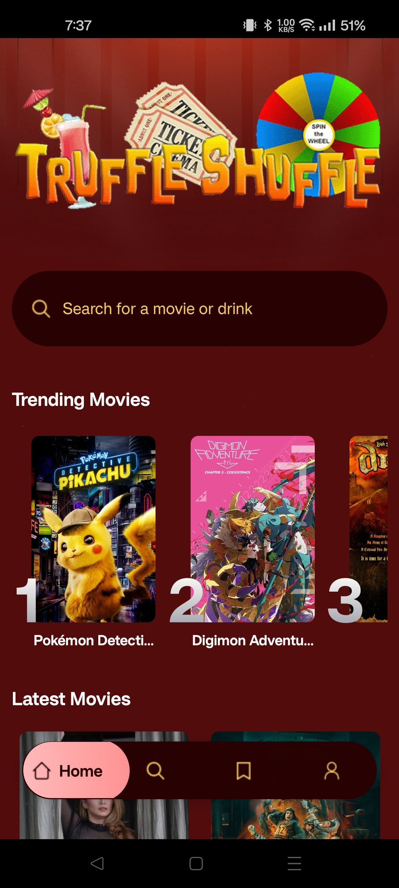

# Truffle-Shuffle
This project is a re-make of a group project I worked on during school called Truffle Shuffle.

# Description
The **Truffle-Shuffle** project is a lightweight application that helps an indecisive user(s) generate ideas on what movie to watch and what cocktail to drink. The user is first given the option to choose a cocktail based on their alcohol preference or just a random drink from the CocktailDB database. After getting their drink, the user is presented with a wheel that lets them spin for a random genre and decade. If need be, the user can respin the wheel to grab a different genre/decade. Based on these results a movie is obtained from the MovieDB database and presented to the user.

# Installation
Install in the app store via Expo

# Credits
- Edward Huang [GitHub](https://github.com/Ejhuang2015)
- JavaScript Mastery [YouTube](https://www.youtube.com/@javascriptmastery)

# Usage
Tutorial Followed:
* [React Native Course for Beginners in 2025 | Build a Full Stack React Native App](https://www.youtube.com/watch?v=f8Z9JyB2EIE)

Original Project:
* [GitHub Repository](https://github.com/Laura-Bullek/Truffle-Shuffle)
* [Main Application](https://laura-bullek.github.io/Truffle-Shuffle/)